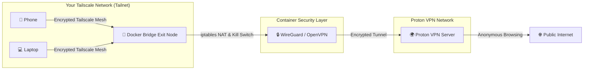

# Proton VPN to Tailscale Bridge Exit Node 🌐🛡️

**English** | [Português](README.pt.md)

[](https://www.docker.com/)
[](https://opensource.org/licenses/MIT)
[](https://tailscale.com)
[](https://protonvpn.com)
[](#)

Route all your private Tailscale network traffic through **Proton VPN** (including the **100% Free tier**) via a lightweight Docker exit node.

Whenever any device on your Tailnet (smartphone, laptop, tablet) connects to this Exit Node, its internet traffic is encrypted and tunnelled securely through Proton VPN servers with full leak protection and kill switch capabilities.



---

## ✨ Features

- **WireGuard & OpenVPN Support**: Optimized for WireGuard (faster speed, minimal CPU usage) with full OpenVPN fallback.
- **Works with Proton VPN Free**: No paid plan required — supports Proton VPN Free tier server configurations.
- **Built-in Kill Switch & Leak Protection**: Drops all outgoing unencrypted traffic (`iptables -P FORWARD DROP`) and disables IPv6 inside the container to prevent IPv6 traffic leaks.
- **Non-Privileged Container**: Operates without `privileged: true`, using only minimum Linux capabilities (`NET_ADMIN`, `NET_RAW`).
- **Interactive Web UI**: Modern web dashboard with drag-and-drop file upload, setup wizard, and real-time status monitoring.
- **Interactive Setup CLI**: Guided terminal wizard (`python setup.py`) to configure your environment in seconds.
- **Multi-Architecture**: Out-of-the-box support for `amd64` (x86_64 PCs & servers) and `arm64` (Raspberry Pi 4/5, Synology NAS, Apple Silicon).
- **Native Healthchecks**: Docker health checks monitoring Tailscale daemon and VPN interface connectivity.

---

## 🧰 Prerequisites

1. **Proton VPN Account** (Free or Paid tier).
2. **Tailscale Account** with access to the Tailscale admin console.
3. **Docker & Docker Compose** installed on your host (Linux PC, Server, Synology/QNAP NAS, or Raspberry Pi).

---

## ⚡ Quick Start (CLI Wizard)

An interactive Python setup script is included to automatically create directories, configure `.env`, and start the containers:

```bash
python setup.py
```

Follow the prompts on your terminal. If you prefer manual setup, follow the guide below.

---

## 🚀 Manual Step-by-Step Setup

### Step 1: Clone Repository & Prepare Directories

```bash
git clone https://github.com/<your-username>/tailscale-proton-bridge.git
cd tailscale-proton-bridge
```

The directories `./vpn/wireguard` and `./vpn/openvpn` are pre-tracked in Git.

---

### Step 2: Download Proton VPN Configuration

#### Option A: WireGuard (Recommended)
1. Sign in to [account.protonvpn.com](https://account.protonvpn.com).
2. Go to **Downloads** -> **WireGuard configuration**.
3. Choose a configuration name, select platform **Linux**, enable **VPN Accelerator**, and pick a server (e.g. Free server).
4. Click **Create** and **Download** the `.conf` file.
5. Save or rename the downloaded file to:
   ```
   ./vpn/wireguard/protonvpn.conf
   ```

#### Option B: OpenVPN (Alternative)
1. In [account.protonvpn.com](https://account.protonvpn.com), go to **Downloads** -> **OpenVPN configuration files**.
2. Select **Linux**, **UDP**, and download a server profile.
3. Save or rename it to:
   ```
   ./vpn/openvpn/protonvpn.ovpn
   ```
4. On the same downloads page, copy your **OpenVPN / IKEv2 username and password** (these are different from your regular login credentials). Either:
   - Put them in `.env` (`PROTONVPN_USER` and `PROTONVPN_PASSWORD`), **OR**
   - Save them to `./vpn/openvpn/credentials.txt` (username on line 1, password on line 2).

---

### Step 3: Configure `.env`

Copy the template file:
```bash
cp .env.example .env
```

Edit `.env` with your settings:
- **`TS_AUTHKEY`**: Generated in Tailscale Admin Console (**Settings -> Keys -> Generate Auth Key**). Enable *Reusable*. (Optional: leave blank to authenticate via web login URL).
- **`VPN_TYPE`**: `wireguard`, `openvpn`, or `auto` (auto-detects configuration file).
- **`TS_HOSTNAME`**: Name for your device on your Tailnet (default: `protonvpn-bridge`).
- (Optional) **`WEBUI_USERNAME`** & **`WEBUI_PASSWORD`**: Fixed credentials for the Web UI.

---

### Step 4: Build & Launch Container

```bash
docker compose up -d --build
```

View live container logs:
```bash
docker compose logs -f
```

---

### Step 5: Approve Exit Node in Tailscale

Tailscale requires manual admin approval for nodes advertising as exit nodes:

1. Open your [Tailscale Admin Console](https://login.tailscale.com/admin/machines).
2. Find your node (e.g., `protonvpn-bridge`).
3. Click the **three dots (...)** next to the machine and choose **Edit route settings**.
4. Check **Use as exit node** and click **Save**.

Your Proton VPN Exit Node is now live!

---

## 🖥️ Web UI Dashboard

A lightweight web dashboard is available at `http://<host-ip>:8080`:

1. **Authentication**: Uses HTTP Basic Auth (`WEBUI_USERNAME` and `WEBUI_PASSWORD`). If no password is set, a temporary one is printed in `docker compose logs webui`.
2. **First Run Wizard**: Automatically launches a 4-step wizard with drag-and-drop file upload for `.conf` or `.ovpn` files.
3. **Manual Login Link**: If no `TS_AUTHKEY` is provided, a clickable login link appears dynamically in the header.
4. **Apply Changes**: Because the Web UI does not access the Docker socket for security reasons, apply saved modifications with:
   ```bash
   docker compose up -d --build vpn-tailscale-bridge
   ```

---

## 📱 How to Use on Your Devices

1. Open the **Tailscale** client on your smartphone, tablet, or laptop.
2. Connect to your Tailnet.
3. Select **Exit Node** and choose `protonvpn-bridge`.
4. Check [ipinfo.io](https://ipinfo.io) or [dnsleaktest.com](https://dnsleaktest.com) to confirm your public IP and DNS reflect your chosen Proton VPN server.

---

## 🔒 Security & Architecture Details

- **Minimal Privileges**: Runs with specific Linux capabilities (`NET_ADMIN` and `NET_RAW`) and `/dev/net/tun` rather than full `privileged: true`.
- **Strict Leak Prevention**:
  - `iptables -P FORWARD DROP`: Default policy drops all routed packets. Packets are forwarded strictly through the VPN interface (`protonvpn` / `tun0`).
  - Container-level IPv6 disabling (`disable_ipv6=1`) and `ip6tables -P FORWARD DROP` ensure zero IPv6 traffic leaks.
- **Docker DNS Compatibility**: Transparently manages `/etc/resolv.conf` to avoid `openresolv` bind-mount collisions common in Docker environments.
- **Auto-Healing**: Continually monitors the VPN connection and Tailscale daemon. If the VPN drops, the container exits and Docker restarts it (`restart: unless-stopped`).

---

## 📄 License

This project is open-source software licensed under the [MIT License](LICENSE).
