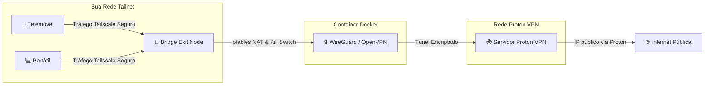

# Proton VPN to Tailscale Bridge Exit Node

[English](README.md) | **Português**

[](https://www.docker.com/)
[](https://opensource.org/licenses/MIT)
[](https://tailscale.com)
[](https://protonvpn.com)
[](#)

Pré-release atual: `v0.1.0-beta.2`

Este projeto permite criar um container Docker que funciona como uma ponte (bridge) entre o **Proton VPN** (incluindo o plano **Free/Gratuito**) e a sua rede privada **Tailscale (Tailnet)**, atuando como um **Exit Node** (Nó de Saída). 

Quando se liga a este Exit Node através de qualquer dispositivo da sua Tailnet (telemóvel, portátil, etc.), todo o seu tráfego de internet será encriptado e encaminhado através dos servidores da Proton VPN.

Esta versão beta destina-se à validação nas plataformas indicadas na matriz
abaixo. Teste o bloqueio de tráfego quando a VPN cai antes de usar a bridge
com tráfego de produção.



---

## Requisitos Prévios

1. **Conta Proton VPN** (o plano Free/Gratuito é totalmente compatível).
2. **Conta Tailscale** com acesso à consola de administração.
3. **Docker e Docker Compose** instalados na máquina hospedeira (PC, Servidor, Synology/QNAP NAS ou Raspberry Pi).

---

## Instalação Rápida (Recomendada via CLI)

Para facilitar todo o processo de instalação e configuração, criamos um script interativo em Python que cria as pastas necessárias automaticamente, ajuda-o a gerar o ficheiro `.env` e inicia o container Docker de forma guiada.

Basta abrir o seu terminal na pasta do projeto e executar:

```bash
python setup.py
```

Siga as instruções indicadas no ecrã! Se preferir realizar a configuração de forma manual, siga o guia passo a passo abaixo.

---

## Passo a Passo de Configuração Manual

### Passo 1: Preparar as Pastas de Configuração
Crie a estrutura de pastas no diretório do projeto para colocar os seus ficheiros da VPN (já criadas se clonou com `.gitkeep`):
* Para **WireGuard** (Recomendado): `./vpn/wireguard/`
* Para **OpenVPN**: `./vpn/openvpn/`

---

### Passo 2: Obter os Ficheiros da Proton VPN

Pode optar por uma das duas vias (a Proton VPN suporta ambas no plano gratuito):

#### Opção A: WireGuard (Recomendado - Mais rápido e menor consumo de CPU)
1. Inicie sessão no seu painel em [account.protonvpn.com](https://account.protonvpn.com).
2. No menu esquerdo, vá a **Downloads** e clique no separador **WireGuard configuration**.
3. Defina um nome para a configuração, selecione a plataforma (**Linux**), ative o **VPN Accelerator** e selecione um servidor gratuito (Free server).
4. Clique em **Create** e depois faça o **Download** do ficheiro `.conf`.
5. Renomeie o ficheiro descarregado para `protonvpn.conf` e coloque-o na pasta:
   `./vpn/wireguard/protonvpn.conf`

#### Opção B: OpenVPN (Alternativa)
1. No painel [account.protonvpn.com](https://account.protonvpn.com), no menu **Downloads**, selecione **OpenVPN configuration files**.
2. Escolha a plataforma (**Linux**), o protocolo (**UDP** recomendado) e descarregue um perfil de servidor gratuito.
3. Renomeie o ficheiro para `protonvpn.ovpn` e coloque-o na pasta:
   `./vpn/openvpn/protonvpn.ovpn`
4. Na mesma página da conta Proton, procure por **OpenVPN / IKEv2 username and password** e copie o utilizador e a palavra-passe fornecidos (são diferentes dos seus dados de login normais).
   * Pode colocar estes valores no ficheiro `.env` (variáveis `PROTONVPN_USER` e `PROTONVPN_PASSWORD`), **OU**
   * Criar um ficheiro de texto chamado `credentials.txt` contendo o utilizador na primeira linha e a palavra-passe na segunda linha, guardando-o na pasta `./vpn/openvpn/credentials.txt`.

---

### Passo 3: Configurar o Ficheiro `.env`

1. Copie o ficheiro de exemplo `.env.example` para `.env`:
   ```bash
   cp .env.example .env
   ```
2. Abra o `.env` e preencha as variáveis:
   * **`TS_AUTHKEY`**: Obtenha na consola do Tailscale em **Settings -> Keys -> Generate Auth Key**. Para uma bridge de longa duração, use uma chave reutilizável e pré-autorizada. Se deixar em branco, autentique através do link apresentado nos logs e na Web UI.
   * **`VPN_TYPE`**: Defina como `wireguard` ou `openvpn` (ou deixe `auto` para deteção automática do ficheiro presente).
   * **`TS_HOSTNAME`**: O nome que deseja dar a este Exit Node na sua consola Tailscale (ex: `protonvpn-bridge`).
   * (Apenas para OpenVPN se não usar `credentials.txt`): Insira o `PROTONVPN_USER` e `PROTONVPN_PASSWORD`.
   * **`WEBUI_USERNAME`** e **`WEBUI_PASSWORD`**: Credenciais obrigatórias da Web UI. A Web UI não inicia com a password vazia.

---

### Passo 4: Construir e Iniciar os Contentores

Com todas as configurações preparadas, inicie o container:

```bash
docker compose up -d --build
```

Pode acompanhar a inicialização e os logs usando:
```bash
docker compose logs -f
```

---

### Passo 5: Aprovar o Exit Node no Tailscale

Por questões de segurança, novos nós que anunciam capacidade de Exit Node precisam ser aprovados manualmente na sua conta Tailscale:

1. Aceda à consola de administração da Tailscale ([login.tailscale.com](https://login.tailscale.com)).
2. Vá a **Machines** e procure pelo seu nó (ex: `protonvpn-bridge`).
3. Clique nos **três pontos (...)** à direita da máquina e selecione **Edit route settings**.
4. Ative a opção **Use as exit node** e salve.

Pronto! O seu Exit Node está totalmente ativo e pronto para uso.

---

## Web UI de Configuração

Além do terminal, o projeto inclui uma interface web intuitiva para gerir a bridge sem precisar de aceder ao host por SSH:

1. Após `docker compose up -d --build`, aceda a `http://<ip-do-host>:8080` (a porta é configurável através de `WEBUI_PORT` no `.env`).
2. **Autenticação**: Defina `WEBUI_USERNAME`/`WEBUI_PASSWORD` no `.env` antes de iniciar a Web UI. A password vazia impede o arranque.
3. **Assistente Inicial**: Na primeira utilização, a Web UI abre automaticamente um assistente de 4 passos com suporte para arrastar e largar os ficheiros de VPN.
4. **Link de Login Manual**: Se não definir `TS_AUTHKEY`, o link para autenticar o Tailscale surge em destaque diretamente na Web UI.
5. **Aplicação de Alterações**: Por segurança (para não expor o socket do Docker à Web UI), após gravar alterações no painel basta correr:
   ```bash
   docker compose up -d --build vpn-tailscale-bridge
   ```
   Se alterou o protocolo, o bind address ou a origem da password da Web UI,
   recrie a Web UI:
   ```bash
   docker compose up -d --build webui
   ```

---

## Como Usar nos Seus Dispositivos

1. Abra a aplicação do **Tailscale** no seu dispositivo (Telemóvel, Computador, etc.).
2. Ligue-se à sua Tailnet.
3. Procure pela opção **Exit Node** na interface.
4. Selecione o nó `protonvpn-bridge`.
5. Aceda a [https://ipinfo.io](https://ipinfo.io) ou [https://dnsleaktest.com](https://dnsleaktest.com) e confirme que o seu IP público e DNS pertencem à Proton VPN!

---

## Segurança e Robustez de Rede

* **Sem Modo Privilegiado (`privileged: false`)**: O contentor apenas utiliza as capacidades mínimas do Linux (`cap_add: NET_ADMIN, NET_RAW`), prevenindo riscos de segurança no anfitrião.
* **Kill Switch para tráfego encaminhado**:
  * Política padrão de firewall `iptables -P FORWARD DROP`.
  * Tráfego de saída só passa se for encaminhado através da interface segura da VPN (`protonvpn` ou `tun0`).
  * IPv6 é integralmente desativado dentro do container (`disable_ipv6=1` e `ip6tables -P FORWARD DROP`) para prevenir fugas de tráfego fora do túnel (IPv6 Leaks).
* **Compatibilidade com Docker / resolvconf**: Tratamento transparente de `/etc/resolv.conf` sem causar conflitos de montagem no Docker com `openresolv`.
* **Auto-healing e Healthchecks**: O bridge testa Tailscale, a interface VPN e um pedido HTTPS através da VPN. Depois de falhas consecutivas, sai para que o Docker o reinicie.
* **Análise das imagens**: A CI analisa ambas as imagens com Trivy. Findings críticos fazem falhar a build; findings de severidade alta nas imagens upstream continuam visíveis no resultado para revisão.
* **Multi-Arquitetura**: Totalmente compatível com processadores `x86_64` (PC / Servidores) e `ARM64` (Raspberry Pi 4/5, Synology NAS, Apple Silicon).

---

### Transporte e acesso da Web UI

Configure estas variáveis no `.env` antes de iniciar os contentores:

```dotenv
WEBUI_USERNAME=admin
WEBUI_PASSWORD=escolha-uma-password-forte
WEBUI_PROTOCOL=http
WEBUI_ACCESS_MODE=all
WEBUI_BIND_ADDRESS=0.0.0.0
```

Para HTTPS, coloque o certificado e a chave em `webui/certs/fullchain.pem` e
`webui/certs/privkey.pem`, e altere `WEBUI_PROTOCOL=https`. O certificado deve
ser válido para o nome/IP usado no browser. Um certificado autoassinado mostra
um aviso no browser e não deve ser usado numa publicação pública.
Os ficheiros montados devem ser legíveis pelo utilizador do container da Web UI (UID 1000).

Para restringir a porta à Tailnet, defina `WEBUI_ACCESS_MODE=tailnet` e use o
IP Tailscale IPv4 do anfitrião, por exemplo:

```dotenv
WEBUI_ACCESS_MODE=tailnet
WEBUI_BIND_ADDRESS=100.101.102.103
```

Para as credenciais do bridge, crie ficheiros em `secrets/` com permissões que
permitam a leitura apenas ao utilizador do container que precisa delas, e use
estas variáveis em vez de guardar os valores no `.env`:

```dotenv
TS_AUTHKEY_FILE=/run/secrets/ts_authkey
PROTONVPN_USER_FILE=/run/secrets/protonvpn_user
PROTONVPN_PASSWORD_FILE=/run/secrets/protonvpn_password
WEBUI_PASSWORD_FILE=/run/secrets/webui_password
```

O bridge corre como root dentro do container e consegue ler os seus secrets.
A Web UI corre com UID 1000, por isso `webui_password` tem de ser legível por
esse UID. Nunca faça commit do conteúdo de `secrets/`.

O modo `tailnet` também aceita por defeito as redes Tailscale IPv4 e IPv6. A
restrição mais forte é o bind a um IP Tailscale específico. A Web UI escreve
credenciais no `.env`, por isso não publique esta porta diretamente na Internet.

### Matriz de compatibilidade

| Plataforma | Estado | Notas |
|---|---|---|
| Debian/Ubuntu Linux com Docker Engine | Suportada | Requer `/dev/net/tun`, forwarding IPv4 e permissões de rede. |
| Synology DSM 7.x com Container Manager | Suportada com validação | Confirmar `/dev/net/tun`, o backend iptables disponível e a arquitetura do NAS. |
| Raspberry Pi 4/5, Raspberry Pi OS 64-bit | Suportada | A imagem CI cobre `arm64`; testar o desempenho do OpenVPN no modelo usado. |
| Docker Desktop em Windows/macOS | Não suportada para o bridge | A UI pode ser construída, mas o exit node requer o dispositivo TUN e rede Linux no anfitrião. |

O teste de integração exige um segundo contentor com Tailscale. Consulte
`tests/integration/test_exit_node.py` e defina `TS_CLIENT_CONTAINER` e
`TS_EXIT_NODE` para o executar.

As verificações locais são:

```bash
python -m pip install -r webui/requirements-dev.txt pip-audit
pytest -q
shellcheck entrypoint.sh healthcheck.sh webui/entrypoint.sh webui/healthcheck.sh
pip-audit -r webui/requirements.txt
```

## Licença

Distribuído sob a licença **MIT**. Consulte o ficheiro [LICENSE](LICENSE) para mais detalhes.
